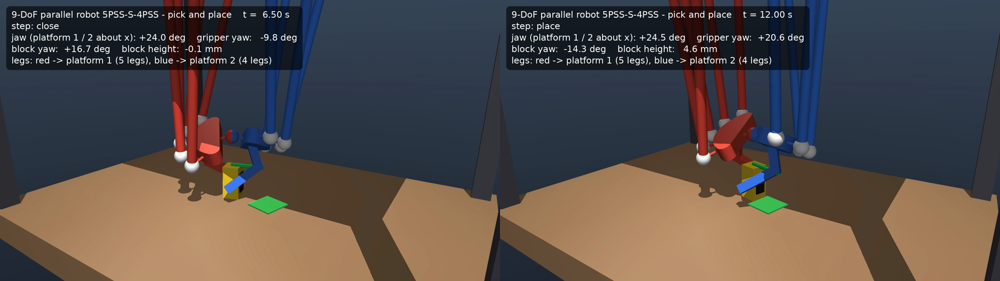

# Robot paralelo de 9 GDL (5P̲SS-S-4P̲SS) en ROS 2

Descripción, cinemática y visualización del robot paralelo de 9 GDL con
capacidad de agarre (Aruquipa, Lambert y Gosselin, Université Laval).


| Paquete | Contenido |
|---|---|
| `ninedof_description` | Mallas STL, `config/geometry.yaml` (medido del CAD) y URDF/xacro |
| `ninedof_kinematics` | IK analítica, FK Gauss-Newton, matrices J y K, nodo `pose_to_joint_states` y tests |
| `ninedof_controllers` | Controlador ros2_control `CartesianPoseController` (C++): recibe la pose de las plataformas, interpola en espacio cartesiano y resuelve la IK en cada ciclo |
| `ninedof_bringup` | Launch, configuración de controladores y RViz |
| `ninedof_mujoco` | Plugin de estado para `mujoco_ros2_control`, demo de pick-and-place y render del video |

```bash
rosdep install --from-paths src --ignore-src -y
colcon build --symlink-install --packages-up-to ninedof_bringup
source install/setup.bash
```

**Con ros2_control** (hardware simulado `mock_components/GenericSystem`):

```bash
ros2 launch ninedof_bringup ninedof.launch.py              # demo de los 9 GDL
ros2 launch ninedof_bringup ninedof.launch.py demo:=false  # esperar comandos
ros2 topic pub --once /cartesian_pose_controller/pose_cmd std_msgs/msg/Float64MultiArray \
  "data: [0.0, 0.0, 0.1467, 0.1, 0.0, 0.0, 0.0, 0.0, 0.3]"   # [x y z a1 a2 a3 b1 b2 b3]
ros2 topic echo /platform_pose                             # pose medida por la FK
ros2 control list_controllers
```

```
pose_cmd ─► cartesian_pose_controller ─► 9 actuadores (position) ─► hardware
                (interpolación + IK)                                    │
RViz ◄─ robot_state_publisher ◄─ /joint_states ◄─ joint_state_broadcaster
                                     ▲
                        fk_joint_state_publisher (FK: articulaciones pasivas + /platform_pose)
```

El controlador interpola la **pose** (no los actuadores): así cada comando es
una solución de la IK y respeta los lazos cerrados. Las poses fuera del
espacio de trabajo o de la carrera (±25 mm) se rechazan.

**Con física en MuJoCo** (cadenas cerradas con restricciones `connect`, plugin
[`mujoco_ros2_control`](https://github.com/ros-controls/mujoco_ros2_control)):

```bash
ros2 launch ninedof_bringup ninedof.launch.py sim:=mujoco            # visor de MuJoCo + RViz
ros2 launch ninedof_bringup ninedof.launch.py sim:=mujoco headless:=true
```

El modelo MJCF se genera desde `geometry.yaml` y `dynamics.yaml` (masas
**estimadas**, a reemplazar por las de SolidWorks):

```bash
cd src/ninedof_description && python3 scripts/generate_mjcf.py
```

⚠️ Con la geometría actual del CAD la plataforma 2 tiene una torsión casi
libre y en simulación cambia de modo de ensamblaje: ver
[docs/nota_diseno_torsion.md](docs/nota_diseno_torsion.md).

### Demo de pick-and-place con reorientación (MuJoCo)



El robot cuelga invertido sobre una mesa, toma un bloque de 12 × 12 × 24 mm,
lo levanta 13 mm, lo gira 30° y lo deja en la zona destino (verde). El video
completo está en [docs/pick_place.mp4](docs/pick_place.mp4).

```bash
ros2 run ninedof_mujoco pick_place_demo --check          # verifica la secuencia contra el espacio de trabajo
ros2 launch ninedof_mujoco pick_place.launch.py          # simulación + demo (visor de MuJoCo y RViz)
ros2 launch ninedof_mujoco pick_place.launch.py headless:=true gui:=false
# -> pick_place_output/pick_place_result.json (SUCCESS/FAIL) y pick_place_qpos.npz
MUJOCO_GL=osmesa ros2 run ninedof_mujoco render_video pick_place_output/pick_place_qpos.npz -o pick_place.mp4
```

Resultado en simulación: error de posición **1,9 mm**, error de orientación
**3,7°**, bloque vertical y apoyado (tolerancias: 4 mm, 5°, 5°).

Limitaciones de la geometría actual del CAD, medidas al preparar la demo:

* **Objeto pequeño**: los dedos son ganchos cortos que pinzan en la punta; un
  bloque de 40 mm no se puede agarrar (los ganchos quedan sobre su cara
  superior). Con 12 mm el bloque entra ~22 mm en la "jaula" de los dedos.
* **Reorientación de 30°** (no 90°): la guiñada común de las dos plataformas
  está mal condicionada ([nota](docs/nota_diseno_torsion.md)); el robot la
  mantiene con error ≤ 4° solo entre −10° y +20°. El robot se monta
  **invertido**: colgando, el modo casi libre queda estable.
* **Agarre virtual**: con estos dedos el agarre por fricción no es fiable en
  simulación (tocan el bloque en aristas opuestas y lo hacen girar). Al cerrar
  la pinza se activa un resorte-amortiguador que sostiene el bloque respecto a
  la plataforma 1 hasta soltarlo (`/mujoco/grasp`). La demo muestra la
  geometría y la precisión del robot, no la mecánica del contacto.

**Solo visualización** (sin ros2_control):

```bash
ros2 launch ninedof_bringup view_robot.launch.py
```

**Tests** (IK/FK contra el CAD, Jacobianos, controlador):

```bash
colcon test --packages-select ninedof_kinematics ninedof_controllers
colcon test-result --verbose
```

URDF no admite cadenas cerradas, así que el robot se describe como un árbol
(actuadores + barras distales, y una cadena virtual de 6 GDL hasta la
plataforma 1 más la esférica central hasta la plataforma 2). El nodo
`pose_to_joint_states` cierra los lazos numéricamente con la cinemática inversa.

# ROS 2 en la nube (GitHub Codespaces)

Este repositorio trae un entorno de ROS 2 **Jazzy** ya configurado, con
`ros2_control`, `ros2_controllers` y Gazebo. No necesitas instalar nada en tu
computadora: todo corre en un servidor de GitHub y lo usas desde el navegador.

## Cómo abrirlo

1. En la página del repositorio en GitHub, pulsa el botón verde **Code**.
2. Abre la pestaña **Codespaces** y pulsa **Create codespace on main**.
3. Espera a que se construya (la primera vez tarda ~5–10 minutos; después es rápido).
4. Se abre VS Code en el navegador, con una terminal en la que ROS 2 ya está cargado.

Pruébalo:

```bash
ros2 run demo_nodes_cpp talker
# en otra terminal:
ros2 run demo_nodes_cpp listener
```

## Ver interfaces gráficas (RViz, Gazebo, rqt)

1. Abre la pestaña **Ports** (junto a la terminal).
   Si no la ves: `Ctrl + Shift + P` → **Ports: Focus on Ports View**.
2. Busca el puerto **6080** ("Escritorio (noVNC)") y pulsa el icono del globo 🌐.
   Si no aparece, pulsa **Add Port** y escribe `6080`.
3. **Agrega `/vnc.html` al final de la dirección** que se abre
   (ej. `https://...-6080.app.github.dev/vnc.html`), pulsa **Connect** y usa la contraseña `ros`.
4. Todo lo que abras desde la terminal (por ejemplo `rviz2` o `gz sim`) aparece ahí.

## Compilar tus paquetes

Pon tus paquetes dentro de la carpeta `src/` y compila desde la raíz:

```bash
sudo apt-get update && rosdep install --from-paths src --ignore-src -y
colcon build --symlink-install
source install/setup.bash
```

Si quieres el código fuente de ros2_control para estudiarlo o modificarlo:

```bash
git clone -b jazzy https://github.com/ros-controls/ros2_control.git src/ros2_control
git clone -b jazzy https://github.com/ros-controls/ros2_control_demos.git src/ros2_control_demos
sudo apt-get update && rosdep install --from-paths src --ignore-src -y
colcon build --symlink-install
```

## Notas sobre el uso gratuito

- Las cuentas personales de GitHub tienen horas gratis de Codespaces cada mes.
  Una máquina de 4 núcleos gasta esas horas el doble de rápido que una de 2.
- **Detén el codespace cuando no lo uses** (github.com/codespaces → `...` → *Stop codespace*).
  Se detiene solo tras 30 minutos sin actividad, y tus archivos se conservan.
- Haz `git commit` y `git push` de tu trabajo con frecuencia.
