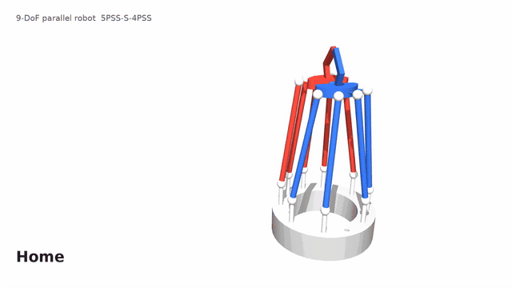

# 9-DOF Parallel Robot with Grasping Capabilities — ROS 2

ROS 2 description, kinematics, control and simulation of the 9-DOF
5<u>P</u>SS-S-4<u>P</u>SS parallel robot with grasping capabilities
(Aruquipa, Lambert and Gosselin, Université Laval).



[Full video (1080p)](docs/showcase.mp4) ·
[Paper](https://doi.org/10.1007/978-3-031-95489-4_10) ·
[Paper video](https://youtu.be/BzgWWMVSFvs) ·
[How to cite](#how-to-cite)

The robot has two moving platforms joined by a passive spherical joint and
driven by nine linear actuators: five legs move platform 1 (red) and four legs
move platform 2 (blue). It provides 3 translations and 6 rotations — the two
platforms can rotate together or relative to each other, which opens and
closes the gripper.

## Packages

| Package | Contents |
|---|---|
| `ninedof_description` | STL meshes, geometry measured on the CAD model (`config/geometry.yaml`), URDF/xacro, MuJoCo models |
| `ninedof_kinematics` | Analytic inverse kinematics, Gauss–Newton forward kinematics, Jacobian matrices **J** and **K**, showcase trajectory, tests |
| `ninedof_controllers` | `CartesianPoseController` (C++, ros2_control): takes the pose of both platforms, interpolates it and solves the inverse kinematics at every cycle |
| `ninedof_bringup` | Launch files, controller configuration, RViz |
| `ninedof_mujoco` | Showcase video renderer and MuJoCo tools |

## Quick start

Requires ROS 2 Jazzy. A ready-to-use [GitHub Codespaces](#run-it-in-the-browser-github-codespaces)
environment is included.

```bash
rosdep install --from-paths src --ignore-src -y
colcon build --symlink-install
source install/setup.bash
```

**Visualization** (RViz, plays the showcase trajectory):

```bash
ros2 launch ninedof_bringup view_robot.launch.py
```

**ros2_control** with simulated actuators:

```bash
ros2 launch ninedof_bringup ninedof.launch.py demo:=false
ros2 topic pub --once /cartesian_pose_controller/pose_cmd std_msgs/msg/Float64MultiArray \
  "data: [0.0, 0.0, 0.1467, 0.1, 0.0, 0.0, 0.0, 0.0, 0.3]"   # [x y z α1 α2 α3 β1 β2 β3]
ros2 topic echo /platform_pose                                # pose from forward kinematics
```

```
pose_cmd ─► cartesian_pose_controller ─► 9 actuators (position) ─► hardware
             (interpolation + IK)                                      │
RViz ◄─ robot_state_publisher ◄─ /joint_states ◄─ joint_state_broadcaster
                                     ▲
                    fk_joint_state_publisher (passive joints + /platform_pose)
```

Poses are given as `[x, y, z]` (m) of the central spherical joint and the
Euler angles `Q = Qx Qy Qz` (rad) of platform 1 (α) and platform 2 (β).
The controller interpolates the pose, not the actuators, so every command is
an inverse-kinematics solution; poses outside the workspace or the actuator
stroke (±25 mm) are rejected.

**MuJoCo physics** (closed kinematic chains, [`mujoco_ros2_control`](https://github.com/ros-controls/mujoco_ros2_control)):

```bash
ros2 launch ninedof_bringup ninedof.launch.py sim:=mujoco
```

URDF cannot describe closed chains, so the robot is written as a tree
(actuators and distal links, plus a virtual 6-DOF chain to platform 1 and the
central spherical joint to platform 2); the forward kinematics closes the loops.
The MuJoCo models close them with `connect` constraints and are generated from
the geometry: `python3 src/ninedof_description/scripts/generate_mjcf.py`.

## Showcase


Translations, rotations of both platforms together, relative rotation (gripper),
a circle and a cone. Every frame is the exact pose of the trajectory with the
actuators given by the inverse kinematics; the whole sequence uses at most
18 mm of the 25 mm actuator stroke.

| Motion | Amplitude |
|---|---|
| Translation X / Y / Z | ±30 / ±30 / ±15 mm |
| Rotation about X / Y / Z | ±20° / ±20° / ±45° |
| Relative rotation (gripper) | 0–30° per platform |
| Circle / cone | radius 25 mm / tilt 20° |

```bash
ros2 run ninedof_mujoco showcase_video --check                       # check the trajectory
MUJOCO_GL=osmesa ros2 run ninedof_mujoco showcase_video -o showcase.mp4
```

## Geometry


The geometry in `config/geometry.yaml` was measured on the SolidWorks
assembly: the URDF matches the CAD model within 0.6 mm, and the inverse
kinematics reproduces the actuator positions of the CAD within 0.02 mm.

## Tests

```bash
colcon test && colcon test-result --verbose
```

Inverse and forward kinematics against the CAD model, Jacobians against finite
differences, the Cartesian controller and the showcase trajectory.

## How to cite

If you use this work, please cite:

> G. Aruquipa, P. Lambert and C. Gosselin, "Kinematic Analysis and Design of a
> Novel 9-DOF Parallel Robot with Grasping Capabilities," in *Proceedings of the
> 2025 CCToMM Symposium on Mechanisms, Machines, and Mechatronics (CCToMM M3 2025)*,
> E. Lanteigne and S. Nokleby, Eds., Mechanisms and Machine Science, vol. 184.
> Cham: Springer, 2025. doi: [10.1007/978-3-031-95489-4_10](https://doi.org/10.1007/978-3-031-95489-4_10)

```bibtex
@inproceedings{aruquipa2025ninedof,
  author    = {Aruquipa, Grover and Lambert, Patrice and Gosselin, Cl{\'e}ment},
  title     = {Kinematic Analysis and Design of a Novel 9-{DOF} Parallel Robot
               with Grasping Capabilities},
  booktitle = {Proceedings of the 2025 {CCToMM} Symposium on Mechanisms,
               Machines, and Mechatronics ({CCToMM} {M3} 2025)},
  editor    = {Lanteigne, E. and Nokleby, S.},
  series    = {Mechanisms and Machine Science},
  volume    = {184},
  publisher = {Springer},
  address   = {Cham},
  year      = {2025},
  doi       = {10.1007/978-3-031-95489-4_10},
  url       = {https://doi.org/10.1007/978-3-031-95489-4_10}
}
```

The same entry is in [`CITATION.bib`](CITATION.bib); GitHub's
**"Cite this repository"** button uses [`CITATION.cff`](CITATION.cff).

## Run it in the browser (GitHub Codespaces)

The repository includes a development container with ROS 2 Jazzy,
ros2_control, MuJoCo and a desktop reachable from the browser.

1. On GitHub, click **Code → Codespaces → Create codespace**
   (the first build takes 5–10 minutes).
2. Build and run as in [Quick start](#quick-start).
3. To see RViz or the MuJoCo viewer: open the **Ports** tab, open port
   **6080** in the browser, add `/vnc.html` to the address, click **Connect**
   and use the password `ros`.

Stop the codespace when you are not using it
(github.com/codespaces → `…` → *Stop codespace*) to save your free hours.

## License

Apache License 2.0.
